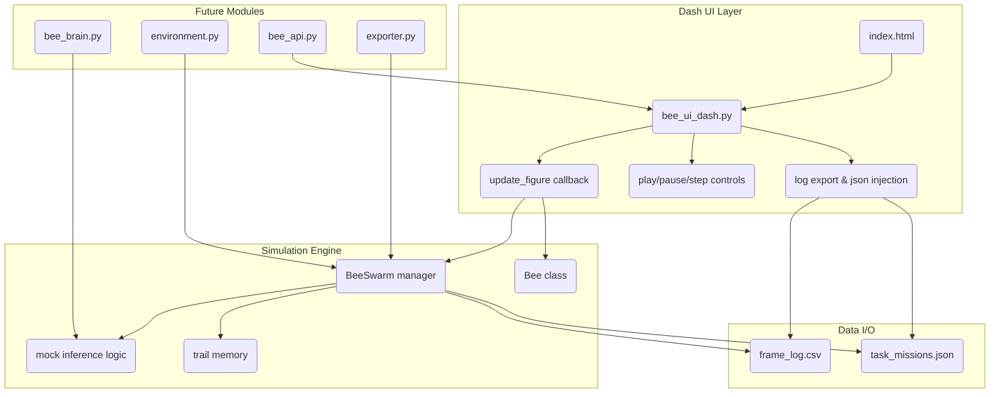

# Planned Project Logic Flow  

```mermaid
flowchart TD
    subgraph UI[Dash UI Layer]
        A1(index.html)
        A2(bee_ui_dash.py)
        A3(update_figure callback)
        A4(play/pause/step controls)
        A5(log export & json injection)
    end

    subgraph Engine[Simulation Engine]
        B1(Bee class)
        B2(BeeSwarm manager)
        B3(mock inference logic)
        B4(trail memory)
    end

    subgraph IO[Data I/O]
        C1(frame_log.csv)
        C2(task_missions.json)
    end

    subgraph Future[Future Modules]
        D1(bee_brain.py)
        D2(environment.py)
        D3(bee_api.py)
        D4(exporter.py)
    end

    %% Connections
    A1 --> A2
    A2 --> A3
    A3 --> B2
    A3 --> B1
    A2 --> A4
    A2 --> A5
    A5 --> C1
    A5 --> C2

    B2 --> B3
    B2 --> B4
    B2 --> C1
    B2 --> C2

    D1 --> B3
    D2 --> B2
    D3 --> A2
    D4 --> B2
```
